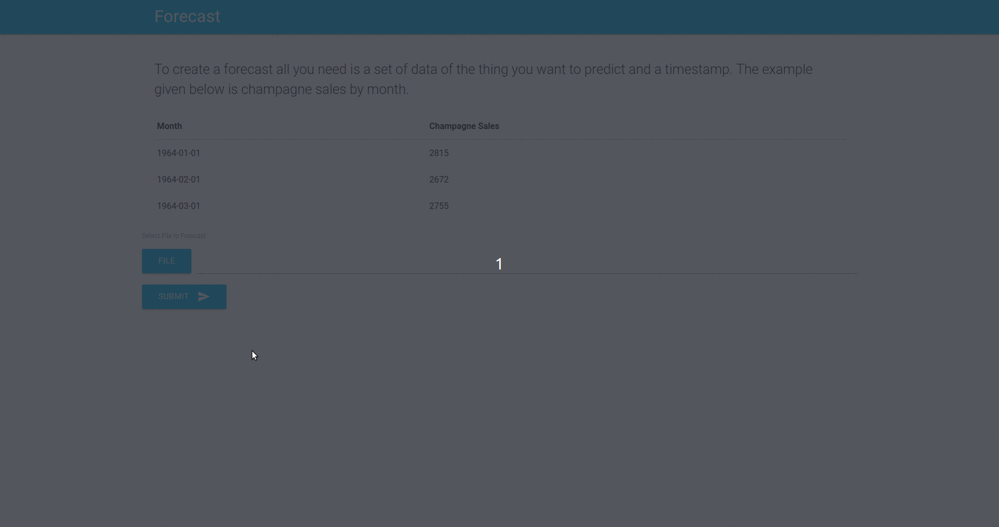

# Suits Forecast

### Why is it called 'Suits?'

Suits is derived from Mobile Suit Gundam. Yes, giant robots. I wanted to wrap machine learning projects in easy to use applications for non-experts. 
Suits Forecast attempts to wrap a very simple Flask app around time-series analysis.

### Set up

First, clone the repo; second, create a virtual environment:

```python
virtualenv env
```

Then enter the environment:

```python
source env/bin/activate
```

Run setup.py

```python
python setup.py
```

Now you can launch the application:

```python
python main.py
```

### Demo


