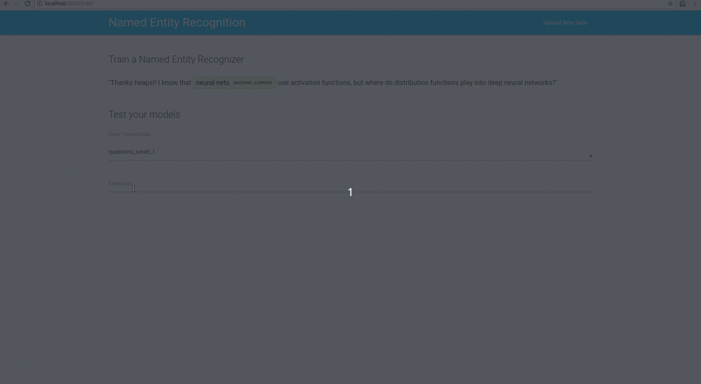

# Suits Named Entity Recognition

### Why is it called 'Suits?'

Suits is derived from Mobile Suit Gundam. Yes, giant robots. I wanted to wrap machine learning projects in easy to use applications for non-experts. 
Suits Named Entity Recognition attempts to wrap a very simple Flask named entity recognition model training.

Built on top of (spaCy)[https://spacy.io/] and (Elasticsearch)[https://www.elastic.co/products/elasticsearch]

### Requirements and Setup

You will need Elasticsearch installed in order to index text for training. Once you have installed Elasticsearch start a local cluster in another terminal:

```
cd elasticsearch-5.6.3

./bin/elasticsearch
```

After cloning the repo create a virtual environment in the main directory:

```
virtualenv env

source env/bin/activate

```

Run setup.py to install requirements and download spaCy models.
```python

python setup.py

```

Then to launch the app run:

```python
python main.py
```

### Training

You will need a csv to text data to train on. The demo uses data from Cross Validated Stack Exchange from Kaggle. You will also need a text file of the terms you wish to label. The demo includes a text file of machine learning terms formatted as follows:

```
logistic regression,
linear regression,
support vector machine,
neural nets,
deep learning,
random forests,
naive bayes
```

The two most important parameters when training are the number of samples and iterations. The larger these are the longer training will take. The terminal will output progress and you will automatically be brought to the testing page when training has finished. 

### How to use trained models

There are two ways to use a model you have trained: first, load the model directly; second, generate a python package from the model and import it.


#### Loading trained models

Import spacy and load the model.

```python
import spacy

ner = spacy.load('en', path='models/'+ model_name)
ner.entity.add_label(entity_name)
```

Now you can either create a function to extract your entities or you can use validator.py

```python

def getEnt(document):
    document = ner(unicode(document))
    return [word.text for word in document if word.ent_type_ == entity_type]
```

Or

```python
import spacy

from validator import entValidator

ner = spacy.load('en', path='models/'+ model)
ner.entity.add_label(entity_name)

ent_model = entValidator(entity_name, terms, ner)

ent_model.getEnt(document)

```

entValidator checks against your terms and looks for ngrams and returns entities it has validated

```python
ent_model.extractTerms(document)
```

#### Generating a model package

Your trained models are in the models directory.


To create a package from your model run:

```
python -m spacy models/your_model packaged_models
```

If you receive the following message:

```
No "name" setting found in meta.json
This setting is required to build your package.

```

Enter your models directory and manually fill out the meta.json:

```
cd my_model
nano meta.json
```

The meta.json template resembles the following:

```
{
   "name": "example_model",
   "lang": "en",
   "version": "1.0.0",
   "spacy_version": ">=2.0.0,<3.0.0",
   "description": "Example model for spaCy",
   "author": "You",
   "email": "you@example.com",
   "license": "CC BY-SA 3.0",
   "pipeline": ["token_vectors", "tagger"]
}

```


Enter the packaged_models directory, enter the model package, and build the package :

```
cd packaged_models
cd en_my_model-1.0.0

python setup.py sdist
```

Now you can install your model as a python package:

```
pip install packaged_models/en_my_model-1.0.0/dist/en_my_model-1.0.0.tar.gz
```

You will now be able to install your model like a Python package:

```python
import en_my_model

nlp = en_my_model.load()
```

### Demos





